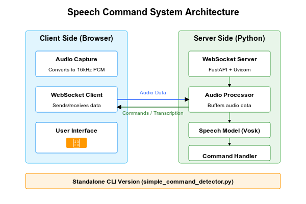

# Speech Command Detector

A real-time voice command detection system that recognizes "play" and "pause" commands using Vosk speech recognition.



## Features

- Real-time speech recognition with WebSockets
- Low-latency command detection
- Responsive web interface with visual feedback
- Standalone command-line interface option
- Works in modern browsers (Chrome, Firefox, Edge)

## System Architecture

As shown in the architecture diagram above, the system consists of two main parts:

1. **Client Side (Browser)**:
   - **Audio Capture**: Converts microphone input to 16kHz PCM format
   - **WebSocket Client**: Handles bidirectional communication with the server
   - **User Interface**: Displays command state and transcriptions

2. **Server Side (Python)**:
   - **WebSocket Server**: FastAPI and Uvicorn handle connections
   - **Audio Processor**: Buffers and processes incoming audio
   - **Speech Model (Vosk)**: Converts audio to text
   - **Command Handler**: Detects commands in the transcription

3. **Standalone CLI Version**: 
   - Uses the same core components without WebSocket/UI layers

## Installation

1. Clone the repository:
   ```
   git clone
   cd speech_command_server
   ```

2. Create a virtual environment and install dependencies:
   ```
   python -m venv .venv
   source .venv/bin/activate  # On Windows: .venv\Scripts\activate
   pip install -r requirements.txt
   ```

3. Download the Vosk speech recognition model:
   ```
   mkdir -p models/data
   cd models/data
   wget https://alphacephei.com/vosk/models/vosk-model-small-en-us-0.15.zip
   unzip vosk-model-small-en-us-0.15.zip
   cd ../..
   ```

## Usage

### Web Interface

1. Start the server:
   ```
   python app.py
   ```

2. Open a web browser and navigate to:
   ```
   http://localhost:8080
   ```

3. Click "Start Listening" and speak commands like "play" or "pause"

### Command Line Interface

For a standalone command-line interface without the web server:

```
python simple_command_detector.py
```

## How It Works

1. The browser captures audio from the microphone using the WebAudio API
2. Audio is processed, resampled to 16kHz, and converted to 16-bit PCM format
3. Audio data is sent to the server via WebSocket
4. The server processes the audio through several components:
   - Audio Processor prepares and buffers the data
   - Speech Model (Vosk) transcribes the audio to text
   - Command Handler detects "play" or "pause" commands
5. Commands are sent back to the browser, which updates the UI accordingly
6. Transcriptions are also sent back for real-time feedback

## Project Structure

```
speech_command_server/
│
├── app.py                    # Main FastAPI server application
├── simple_command_detector.py # Standalone CLI tool
├── requirements.txt          # Python dependencies
├── README.md                 # Documentation
├── sysArch.png               # System architecture diagram
│
├── models/
│   ├── __init__.py           # Makes models a package
│   ├── asr_model.py          # Speech recognition model
│   └── data/                 # Speech model data
│       └── vosk-model-small-en-us-0.15/
│
├── utils/
│   ├── __init__.py           # Makes utils a package
│   ├── audio_processor.py    # Audio processing utilities
│   └── command_handler.py    # Command detection logic
│
└── static/
    └── index.html            # Web interface
```

## Extending the System

This project can be extended in several ways:

### 1. Add More Voice Commands

To add new commands, modify the `CommandHandler` class in `utils/command_handler.py`:

```python
def __init__(self):
    """Initialize the command handler"""
    # Define command keywords and synonyms
    self.commands = {
        "play": ["play", "start", "begin", "resume", "go"],
        "pause": ["pause", "stop", "halt", "freeze", "wait"],
        # Add new commands here:
        "next": ["next", "skip", "forward"],
        "previous": ["previous", "back", "backward"],
        "volume_up": ["louder", "increase volume", "volume up"],
        "volume_down": ["quieter", "decrease volume", "volume down"]
    }
```

### 2. Integrate with External Systems

You can extend the command handling to control real applications:

```python
def _apply_cooldown(self, command: str) -> Optional[str]:
    """Apply cooldown logic and handle system integration"""
    # [Existing cooldown code]
    
    # Add integration with external systems
    if command == "play":
        # Example: Use subprocess to control a media player
        import subprocess
        subprocess.run(["playerctl", "play"])
    elif command == "pause":
        subprocess.run(["playerctl", "pause"])
        
    return command
```

### 3. Improve Speech Recognition

You can improve recognition accuracy by:

1. Using a larger Vosk model
2. Adding custom vocabulary or word boosting:

```python
def __init__(self, model_path: Optional[str] = None):
    # [Existing initialization code]
    
    # Create recognizer with model
    self.recognizer = KaldiRecognizer(self.vosk_model, self.sample_rate)
    
    # Add custom vocabulary or boost specific words
    self.recognizer.SetWords(True)
    self.recognizer.SetPartialWords(True)
    
    # Boost command keywords for better recognition
    grammar = '["play", "pause", "next", "previous", "stop"]'
    self.recognizer.SetGrammar(grammar)
```

### 4. Add Authentication

For multi-user applications, add authentication to the FastAPI server:

```python
from fastapi import Depends, FastAPI, HTTPException, status
from fastapi.security import OAuth2PasswordBearer, OAuth2PasswordRequestForm

# [Authentication code setup]

@app.websocket("/ws")
async def websocket_endpoint(websocket: WebSocket, current_user: User = Depends(get_current_user)):
    # Only authenticated users can use the WebSocket
    # [Existing WebSocket code]
```

### 5. Implement Voice Profiles

For improved accuracy, add voice profile training:

```python
class UserProfile:
    def __init__(self, user_id):
        self.user_id = user_id
        self.voice_samples = []
        
    def add_sample(self, audio_data):
        self.voice_samples.append(audio_data)
        
    def train(self):
        # Process voice samples to create user-specific model adjustments
        pass
```

## Troubleshooting

- **Browser doesn't detect microphone**: Make sure you're using a modern browser and accessing the site via https:// or localhost
- **No transcription appears**: Check that your microphone is working and properly selected in the browser
- **Server doesn't start**: Make sure the Vosk model is downloaded and extracted to the correct location
- **WebSocket disconnects**: Check your network connection and firewall settings

## Requirements

- Python 3.10+
- Vosk speech recognition model
- Modern web browser
- Microphone

## License

MIT License